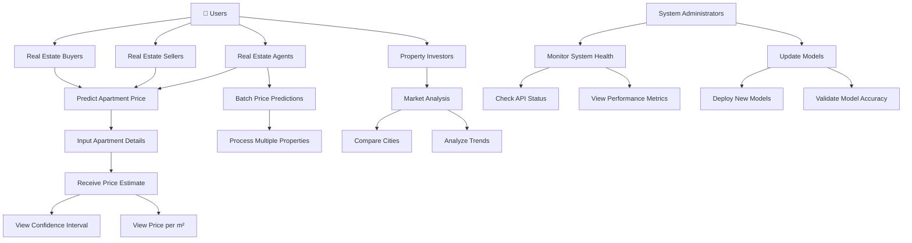
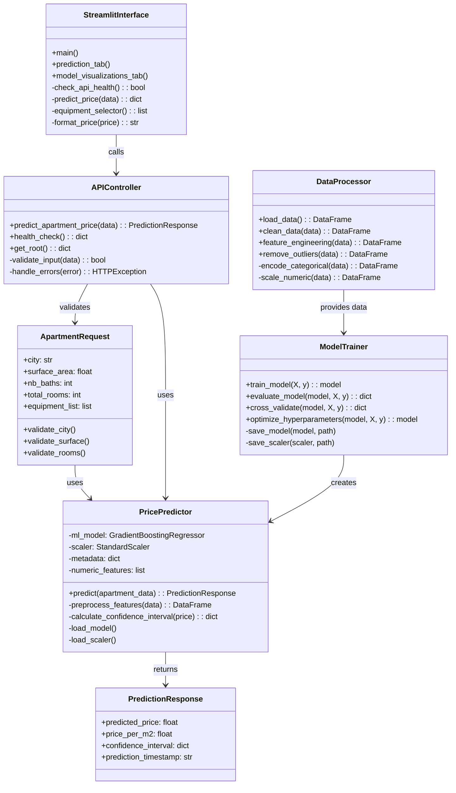
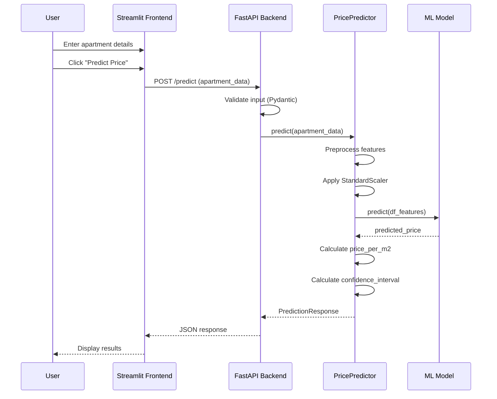
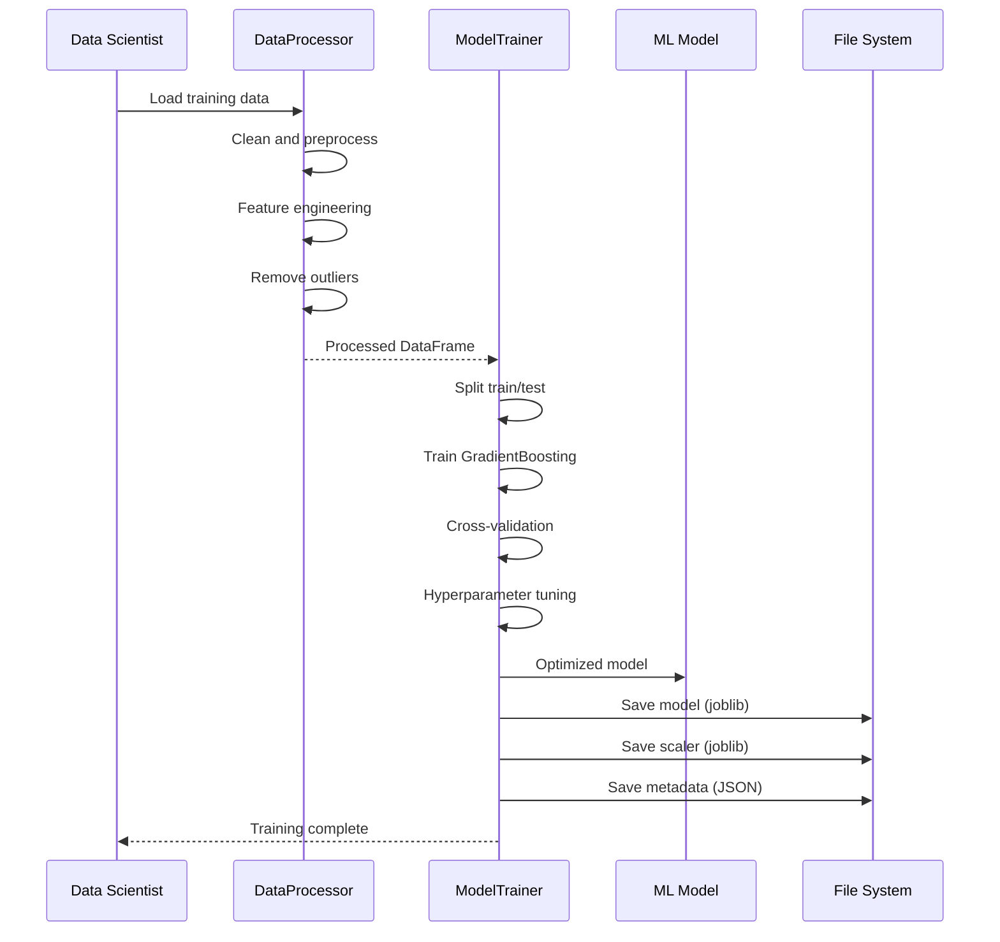
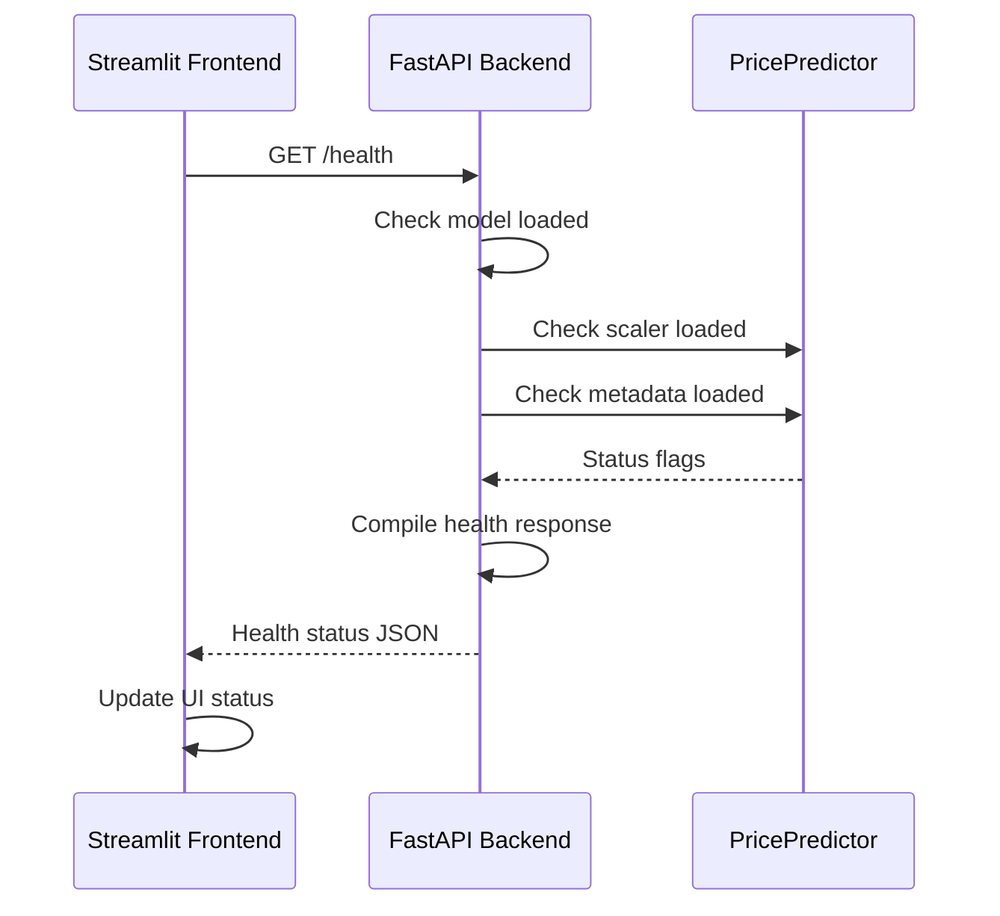
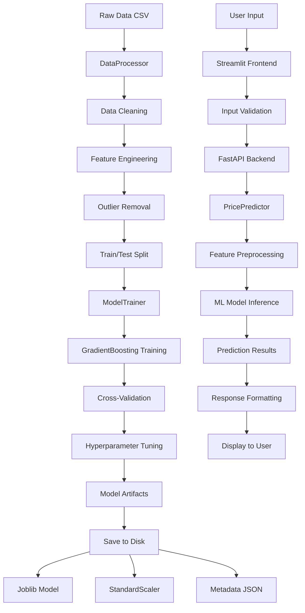

# 🏠 SalesHouses - Moroccan Real Estate Price Prediction System
## Design & Conception Report

**Date:** January 28, 2026  
**Version:** 1.0  
**Author:** AI Assistant

---

## 📋 Table of Contents

1. [Project Overview](#project-overview)
2. [Stakeholders & Users](#stakeholders--users)
3. [System Architecture](#system-architecture)
4. [Use Case Diagram](#use-case-diagram)
5. [Class Diagram](#class-diagram)
6. [Sequence Diagrams](#sequence-diagrams)
7. [Data Flow](#data-flow)
8. [Technical Specifications](#technical-specifications)

---

## 🎯 Project Overview

**SalesHouses** is an AI-powered Moroccan real estate price prediction system that provides accurate apartment price estimates based on location, size, features, and amenities. The system combines machine learning with a modern web interface to serve real estate professionals and individuals.

### Key Features
- **Real-time Price Prediction**: Instant apartment price estimates
- **Multi-city Support**: Coverage for major Moroccan cities
- **Feature-rich Input**: Surface area, rooms, bathrooms, equipment
- **Confidence Intervals**: Price range estimates
- **Interactive Web Interface**: User-friendly Streamlit application
- **REST API**: FastAPI backend for integrations

### Business Value
- Helps buyers make informed purchasing decisions
- Assists sellers in pricing their properties competitively
- Supports real estate agents with market analysis
- Provides investors with data-driven insights

---

## 👥 Stakeholders & Users

### Primary Users

1. **🏠 Real Estate Buyers**
   - **Goal**: Get accurate price estimates before purchasing
   - **Needs**: Quick, reliable price predictions with confidence intervals
   - **Usage**: Input apartment details, receive instant estimates

2. **💼 Real Estate Sellers**
   - **Goal**: Price properties competitively based on market data
   - **Needs**: Market price validation, comparative analysis
   - **Usage**: Validate asking prices against AI predictions

3. **👨‍💼 Real Estate Agents**
   - **Goal**: Provide clients with professional price assessments
   - **Needs**: Fast, accurate valuations for multiple properties
   - **Usage**: Batch predictions, client presentations

4. **🏢 Property Investors**
   - **Goal**: Analyze market trends and investment opportunities
   - **Needs**: Price per square meter analysis, city comparisons
   - **Usage**: Market research, investment planning

### Secondary Stakeholders

5. **🔧 System Administrators**
   - **Goal**: Maintain system performance and data quality
   - **Needs**: Model monitoring, performance metrics
   - **Usage**: System health checks, model updates

6. **📊 Data Scientists**
   - **Goal**: Improve model accuracy and add features
   - **Needs**: Access to training data, model performance metrics
   - **Usage**: Model retraining, feature engineering

---

## 🏗️ System Architecture

```
┌─────────────────┐    ┌─────────────────┐    ┌─────────────────┐
│   Streamlit     │    │    FastAPI      │    │   ML Model      │
│   Frontend      │◄──►│    Backend      │◄──►│   (Gradient     │
│                 │    │                 │    │    Boosting)    │
└─────────────────┘    └─────────────────┘    └─────────────────┘
         │                       │                       │
         ▼                       ▼                       ▼
┌─────────────────┐    ┌─────────────────┐    ┌─────────────────┐
│   User Input    │    │   Prediction    │    │   Model         │
│   Validation    │    │   Engine        │    │   Artifacts     │
└─────────────────┘    └─────────────────┘    └─────────────────┘
```

### Architecture Components

1. **Frontend Layer (Streamlit)**
   - User interface for input collection
   - Results visualization
   - Model performance display

2. **Backend Layer (FastAPI)**
   - REST API endpoints
   - Input validation (Pydantic)
   - Model inference
   - CORS support

3. **ML Layer (Scikit-learn)**
   - Gradient Boosting Regressor
   - Feature preprocessing
   - StandardScaler for normalization

4. **Data Layer**
   - Training data (CSV)
   - Model artifacts (joblib)
   - Metadata (JSON)

---

## 📋 Use Case Diagram



---

## 📊 Class Diagram



---

## 🔄 Sequence Diagrams

### Price Prediction Sequence



### Model Training Sequence



### API Health Check Sequence



---

## 🌊 Data Flow



---

## 🔧 Technical Specifications

### Backend (FastAPI)
- **Framework**: FastAPI 0.100+
- **Language**: Python 3.8+
- **Validation**: Pydantic v2
- **CORS**: Enabled for all origins
- **Endpoints**:
  - `GET /` - Root endpoint
  - `GET /health` - System health check
  - `POST /predict` - Price prediction

### Frontend (Streamlit)
- **Framework**: Streamlit 1.20+
- **Features**: Interactive widgets, custom CSS
- **Components**: Tabs, columns, metrics, images
- **Validation**: Client-side input validation

### Machine Learning
- **Algorithm**: Gradient Boosting Regressor
- **Library**: Scikit-learn 1.3+
- **Metrics**:
  - R² Score: 82.7%
  - MAE: 185,807 MAD
  - RMSE: 273,802 MAD
- **Features**: 25+ engineered features
- **Preprocessing**: StandardScaler, One-hot encoding

### Data Processing
- **Input Format**: CSV (Moroccan apartment data)
- **Features**: City, surface area, rooms, bathrooms, equipment
- **Output**: Price predictions with confidence intervals
- **Validation**: Comprehensive input validation

### Deployment
- **Container**: Docker support
- **Environment**: Python virtual environment
- **Dependencies**: Managed via pyproject.toml
- **Model Storage**: Joblib serialization

---

## 🎨 UI/UX Design

### Color Scheme
- **Primary**: Blue (#3b82f6)
- **Secondary**: Gray (#6b7280)
- **Success**: Green (#10b981)
- **Warning**: Yellow (#f59e0b)
- **Error**: Red (#ef4444)

### Interface Components
- **Header**: Centered title with icon
- **Tabs**: Prediction and Model Info
- **Forms**: Two-column layout for inputs
- **Results**: Gradient price box with animations
- **Metrics**: Card-based performance display

### Responsive Design
- **Mobile**: Single column layout
- **Desktop**: Multi-column layouts
- **Interactive**: Real-time equipment selection

---

## 🔒 Security & Validation

### Input Validation
- **Surface Area**: 20-500 m²
- **Rooms**: 1-15
- **Bathrooms**: 0-10
- **City**: Predefined Moroccan cities
- **Equipment**: Controlled vocabulary

### API Security
- **CORS**: Configured for web access
- **Rate Limiting**: Not implemented (future enhancement)
- **Authentication**: Not required (public API)

### Data Privacy
- **No User Data Storage**: Stateless predictions
- **No Personal Information**: Only property details
- **Model Privacy**: Proprietary algorithm protection

---

## 📈 Performance Metrics

### Model Performance
- **Accuracy**: 82.7% R² score
- **Precision**: ±15% confidence interval
- **Speed**: <1 second per prediction
- **Scalability**: Handles multiple concurrent requests

### System Performance
- **API Response Time**: <500ms
- **Frontend Load Time**: <2 seconds
- **Memory Usage**: <200MB
- **CPU Usage**: Minimal for inference

---

## 🚀 Future Enhancements

### Phase 2 Features
- **User Accounts**: Save favorite searches
- **Batch Processing**: Multiple property analysis
- **Market Trends**: Historical price analysis
- **Location Services**: GPS-based city detection
- **Photo Analysis**: Image-based feature detection

### Technical Improvements
- **Model Updates**: Automated retraining pipeline
- **A/B Testing**: Model performance comparison
- **API Versioning**: Backward compatibility
- **Monitoring**: Performance dashboards
- **Caching**: Prediction result caching

---

## 📞 Support & Maintenance

### System Monitoring
- **Health Checks**: Automated API status monitoring
- **Error Logging**: Comprehensive error tracking
- **Performance Metrics**: Response time monitoring
- **Model Drift Detection**: Accuracy monitoring over time

### Maintenance Schedule
- **Daily**: Health check automation
- **Weekly**: Performance review
- **Monthly**: Model accuracy validation
- **Quarterly**: Feature importance analysis
- **Annually**: Complete model retraining

---

*This design document provides a comprehensive overview of the SalesHouses Moroccan real estate price prediction system. The system is designed for scalability, maintainability, and user experience excellence.*</content>
<parameter name="filePath">c:\Users\user\Desktop\pfma\pfma\pfma\design_report.md